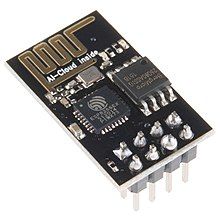
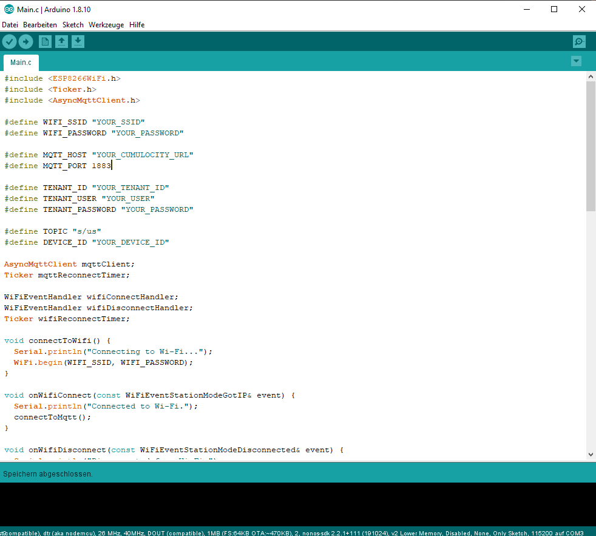
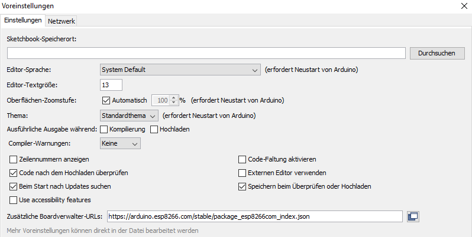
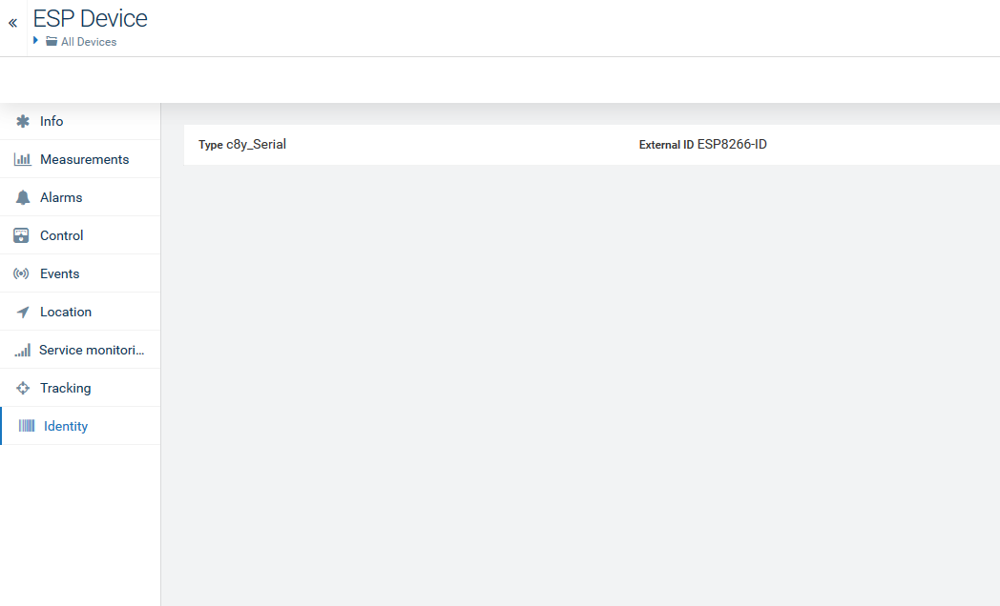

# Cumulocity Example for ESP Boards
This is an example for an ESP Board in order to communicate RSSI and other Data to the cumulocity platform via MQTT. Its a short example on how to implement the basic communication on a very small device or how to implement communication embedded.
Cumulocity is an IoT platform that enables rapid connections of many, many different devices and applications. It allows you to monitor and respond to IoT data in real time and to spin up this capability in minutes. More information on Cumulocity IoT and how to start a free trial can be found [here](https://www.softwareag.cloud/site/product/cumulocity-iot.html#/).

Cumulocity IoT enables companies to to quickly and easily implement smart IoT solutions.

______________________
For more information you can Ask a Question in the [TECHcommunity Forums](https://tech.forums.softwareag.com/tags/c/forum/1/Cumulocity-IoT).

You can find additional information in the [Software AG TECHcommunity](https://tech.forums.softwareag.com/tag/Cumulocity-IoT).
______________________

These tools are provided as-is and without warranty or support. They do not constitute part of the Software AG product suite. Users are free to use, fork and modify them, subject to the license agreement. While Software AG welcomes contributions, we cannot guarantee to include every contribution in the master project.

Contact us at [TECHcommunity](mailto:technologycommunity@softwareag.com?subject=Github/SoftwareAG) if you have any questions.

## ESP 8266

The ESP8266 is a low-cost Wi-Fi microchip with full TCP/IP stack and microcontroller.
The ESP-01 module allows microcontrollers to connect to a Wi-Fi network and make simple TCP/IP connections using Hayes-style commands. Since it is very cheap and has multiple in- and outputs it is very common in IoT Projects or PoC´s.

## Preparation of Arduino IDE

The Arduino IDE is very easy to use.

In order to setup your Arduino IDE to work with your esp8266 arduino compatible module you need to make the following steps:

    1. Connect your ESP8266-01 Module to PC
    2. Open your Arduino IDE
    3. Go to File -> Preferences
    4. Add this link to Additional Board Manager
    5. Go to Tools -> Board Manager
    6. Find ESP8266 board set and activate it
    7. Select Generic ESP8266 board from Tools->Boards
    8. Choose your programmer COM port

## Device Creation

You could either create the device in advance or just keep sending data. The device will be created if it is not registered on the platform. The Client ID of the MQTT Connector gives the Identifier within the device management.

Additional Information regarding device creation can be found either in the examples or on the official documentation.

 1. [Device Creation](https://github.com/SoftwareAG/cumulocity-iot-examples/tree/master/devicecreation)
 2. [Cumulocity Documentation](https://cumulocity.com/guides/device-sdk/introduction/)

## Example Code

Within the loop() function the RSSI of the WLAN module will be send in a 2s interval.
Additional functions are already  implement such as creation of Events or Alarms.
You can find additonal information regarding the MQTT interface on the MQTT cheat sheet or in the documentation.

 1. [Cheat Sheet](https://support.cumulocity.com/hc/en-us/article_attachments/360000089547/cheatsheet.pdf)
 2. [MQTT Interface](https://cumulocity.com/guides/device-sdk/mqtt-examples/)

## Multi-product

 1. [Cumulocity-Freshdesk](https://github.com/SoftwareAG/webmethodsio-examples/tree/master/cumulocitytofreshdesk)
 1. [Cumulocity-S3](https://github.com/SoftwareAG/webmethodsio-examples/tree/master/cumulocity-s3)
 1. [Process EDI from Cumulocity Alarm](https://github.com/SoftwareAG/webmethods-b2b-examples/tree/master/c8y-wmio-hybrid-b2b-create-edi850)
